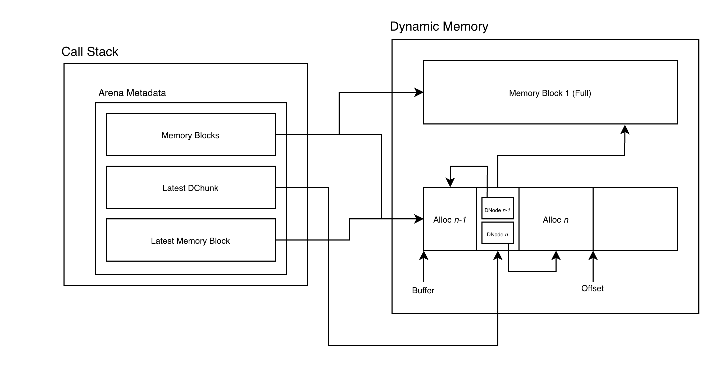
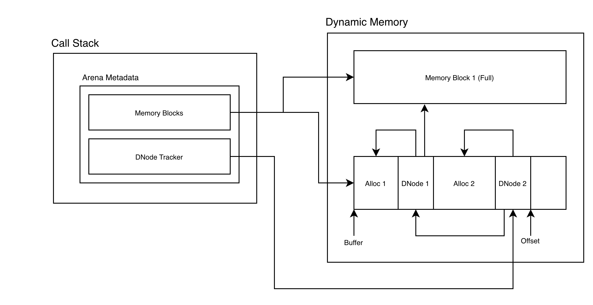

# Arena

`Arena` is a header-only thread-local arena allocator for C++23 that uses bump pointers to 
allocate dynamic memory from a pool of memory blocks. `Arena` also supports resizing logic by dynamically
 claiming more memory blocks when needed.

This reduces the need for expensive `malloc` overhead and heap fragmentation during run-time whilst simplifying 
lifetime management for common objects.




## Using Arena
`ArenaV2` can be used directly with STL containers,
```c++
#include "arena.h"
#include "allocator.h"

 ArenaV2 arena(65536);
 
 std::unordered_map<int, int, std::hash<int>, std::equal_to<int>, ArenaAllocator<std::pair<const int, int>>> map(10, std::hash<int>(), std::equal_to<int>(), ArenaAllocator<std::pair<const int, int>>(arena));
 std::list<int, ArenaAllocator<int>> lst{ArenaAllocator<int>(arena)};
 std::vector<int, ArenaAllocator<int>> vec{ArenaAllocator<int>(arena)};
 std::map<int, int, std::less<int>, ArenaAllocator<std::pair<const int, int>>> map{std::less<int>(),ArenaAllocator<std::pair<const int, int>>(arena)};
```
It can also be used as a standalone memory pool.
```c++

```

## Benchmarks
We benchmark insert operations in STL containers against the standard GNU malloc.

| Container         | Size | GNU Malloc (ns) | Arena Alloc (ns) | Speedup |
|-------------------|------|---------------------|-----------------------|---------|
| **std::vector**   | 1024 | 908 ns              | 539 ns                | **1.68×** |
| **std::vector**        | 4096 | 2793 ns             | 2127 ns               | **1.31×** |
| **std::list**          | 1024 | 18,370 ns           | 3,312 ns              | **5.55×** |
| **std::list**          | 4096 | 77,110 ns           | 13,036 ns             | **5.91×** |
| **std::unordered_map** | 1024 | 24,357 ns           | 7,487 ns              | **3.25×** |
| **std::unordered_map** | 4096 | 101,346 ns          | 30,498 ns             | **3.32×** |
| **std::map**           | 1024 | 42,886 ns           | 22,516 ns             | **1.90×** |
| **std::map**           | 4096 | 175,753 ns          | 94,429 ns             | **1.86×** |


## Dev Log

### `ArenaV2`

#### Improved cache locality
In our original implementation, the ordering of destructor nodes are stored in a linked list across multiple 
memory blocks. The layout of ArenaV1:



Unfortunately, when we clear `mem_blocks`, this requires us to manually traverse the linked list sequentially,
 where the linked list spans multiple `MemBlock`s.

To improve cache locality, we keep multiple `DestructorNode` in chunks of contiguous memory, `DestructorChunk`, and 
 maintain a linked list of `DestructorChunk` instead. This allows us to have flexibility in allocating more memory for
`DestructorNode`s whilst maintaining cache locality.

#### Manual alignment calculation
Instead of relying on `std::align` to find aligned addresses, we manually 
calculate the alignment based on bit masking. This trick works on the fact that subtracting 1 on a binary bitstring flips 
all bits after that 1 bit, and `alignof` gives us the memory alignment requirement, which is always in powers of 2. 

```c++
 const uintptr_t curr = reinterpret_cast<uintptr_t>(mem_block.buffer + mem_block.offset);
 const uintptr_t aligned = (curr + align - 1) & ~(align - 1);
```

`(curr + align - 1)` rounds the address to the next boundary, then we use `~(align-1)` to create 
an inverted mask of the lower bits. We use this mask to clear the lower bits to force alignment.

Likewise, we use the similar concept to check for the number of bytes we are past the last aligned address.
```c++
(reinterpret_cast<uintptr_t>(ptr) & (align - 1)) == 0
```

This is faster because there is no longer function call overhead from `std::align`, additionally
 we utilise fewer instructions as compared to the internals of `std::align`.

#### Compiler friendly code
Hot path is now kept in line and cold path is moved to a separate function with in-lining explicitly disabled. This enables
better utilization of instruction caches. 

Hot and cold paths are also marked with compiler attributes, this allows compiler to how often we expect
 code branch to be executed at runtime, allowing for better code layout and branch prediction.

#### Reduced pointer indirection
We now directly track the index of the latest `MemBlock` and `DestructorNode`, allowing for faster access.

### `ArenaV1`

#### Removed virtual destructors
The destructor functions within each `DestructorBlock` were originally kept as type-erased virtual functions. 
```c++
[p] {static_cast<T*>(p)->~T();}
```
This means for each object added to `MemBlock`, we need to maintain a vtable entry, creating a layer of indirection. 
In the revised implementation, we declare a static template for the destructor function instead:

```c++
template<typename T>
static void destruct(void* p) noexcept {
    static_cast<T*>(p)->~T();
}
```
This generates a destruct function for each type during compile time instead, with a concrete implementation this also
 allows the compiler to directly inline the function call.


#### Reduced smart pointer overhead
The initial implementation utilises a vector of `std::unique_ptr` to manage `MemBlock` lifetimes. 

While this allowed for RAII, it also resulted in indirection penalty. Since the lifetime of 
our `Arena` is tied to each `MemBlock`, we never need to worry about sharing the pointer to other 
objects. Hence, paying this penalty is not really necessary. 

In the revised implementation, we allow the `Arena` to directly own `MemBlock`, and allow it to be
 automatically freed when `mem_blocks` is freed.